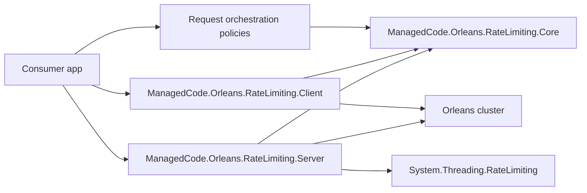
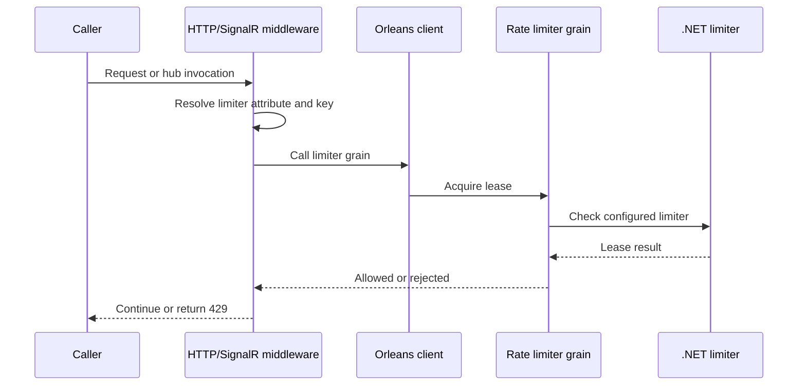
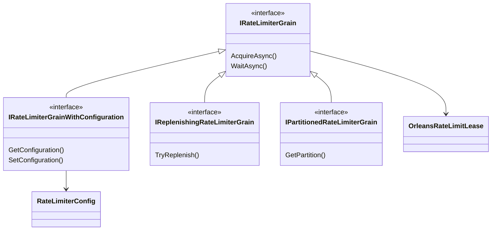

# Architecture

This solution provides Orleans-backed distributed rate limiting for grain calls, ASP.NET Core HTTP pipelines, and SignalR hubs.

## Module Boundaries

## Request Flow

## Core Contracts

## Design Rules

- Core owns contracts, attributes, models, holder abstractions, and Orleans serialization surrogates.
- Core exposes request orchestration abstractions for user, group, tenant, endpoint, grain, IP, and custom partitions.
- Client owns ASP.NET Core middleware, SignalR filters, and application/client registration helpers.
- Server owns grain implementations, incoming grain call filters, and silo registration helpers.
- Tests prove behaviour through TUnit, Shouldly, TestServer, and Orleans test hosting.
- Public grain interfaces and response semantics are package contracts; treat breaking changes as explicit architecture work.
