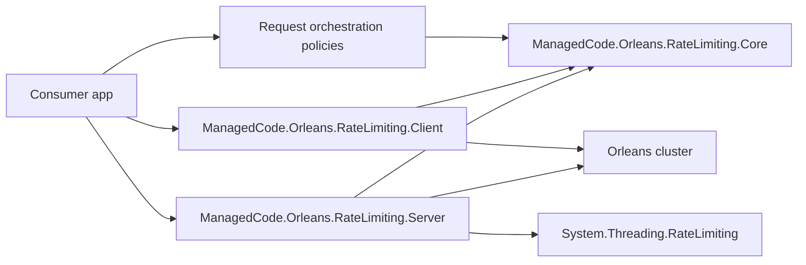
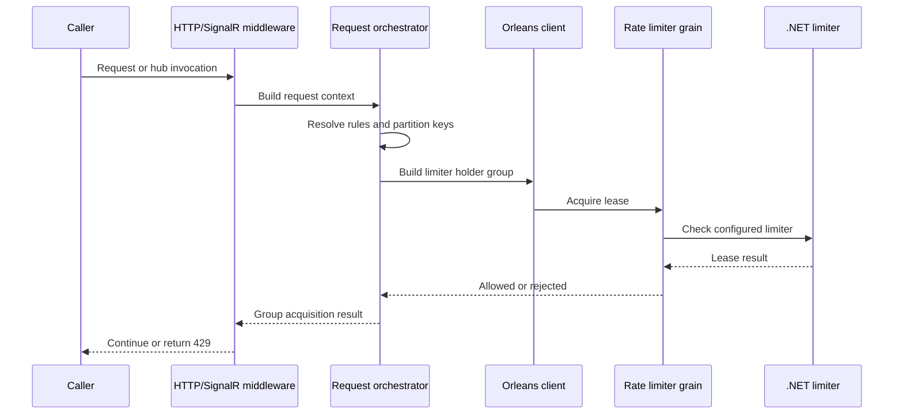
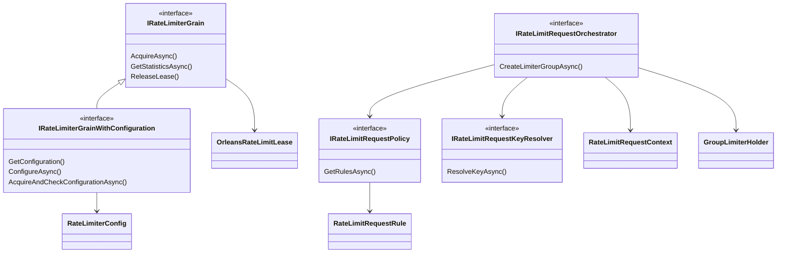

# Architecture

This solution provides Orleans-backed distributed rate limiting for grain calls, ASP.NET Core HTTP pipelines, and SignalR hubs.

## Module Boundaries

## Request Flow

## Core Contracts

## Design Rules

- Core owns contracts, attributes, models, holder abstractions, and Orleans serialization surrogates.
- Core exposes request orchestration abstractions and default implementations for user, group, tenant, role, endpoint, grain, IP, and custom partitions.
- Client owns ASP.NET Core middleware, SignalR filters, and application/client registration helpers.
- Server owns grain implementations, incoming grain call filters, and silo registration helpers.
- Tests prove behaviour through TUnit, Shouldly, TestServer, and Orleans test hosting.
- Public grain interfaces, orchestration rules, and lease semantics are package contracts; treat breaking changes as explicit architecture work.

## Current Architecture Decisions

- New application-level limits should use `IRateLimitRequestOrchestrator` and `UseOrleansRequestRateLimiting`.
- HTTP and SignalR integrations should use named policies when both run in the same application.
- Attribute-based HTTP middleware remains available for existing controller flows, but it is no longer the only client path.
- SignalR rate limiting is policy-driven and registered through `AddSignalR().AddOrleansRateLimiting(...)`.
- Removed commented partitioned/replenishing grain placeholders. Real partitioning now lives at the request orchestration layer, which maps partitions to existing Orleans-backed limiter grains.
