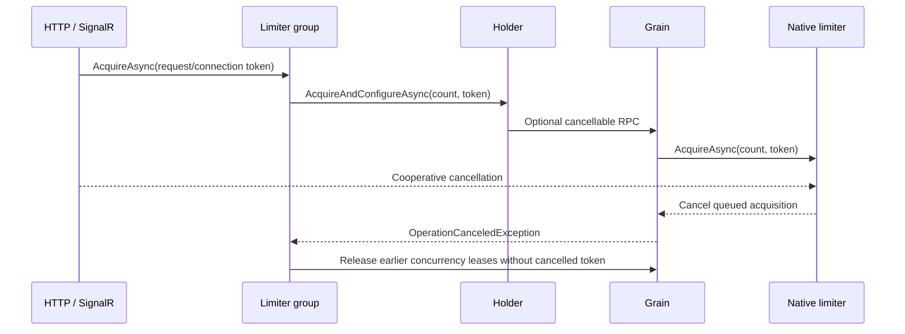

# Cancellation, persistence and observability

## Scope

Implement the accepted modernization slices: additive cancellable grain/holder APIs,
HTTP and SignalR propagation, cancellable persistence writes, async TestingHost,
controlled grain clocks, bounded metrics, and arithmetic/storage failure regressions.
Preserve published API and RPC identities, quota semantics and storage-provider choice.
Verify focused integration tests, full suite, analyzers, formatting, coverage, package
compatibility and CI. Performance-only lease/RPC removal needs benchmark evidence and
an explicit metadata compatibility design; it is not bundled into this behavior change.

## Cancellation ownership

`ICancellableRateLimiterGrain` and its generic configuration counterpart are new
capabilities. Original interfaces and all original overloads remain unchanged.
`ICancellableLimiterHolder` is optional, so consumer implementations of `ILimiterHolder`
remain source-compatible. The group observes cancellation before/after each acquisition,
retains lease ownership before checking a late cancellation, and rolls back partial
acquisitions. Legacy holders cannot interrupt their own queue; the group waits for their
result, releases any late lease, then reports cancellation. Empty groups also observe it.

Deploy updated silos before updated middleware/clients start calling the new interfaces.
Previous client binaries continue using supported old RPCs. All 10.2 holder acquisition
overloads now use bounded RPCs. Native token propagation is used only when the caller
token can be cancelled; other calls pass only the server wait budget. Upgrade
all silos serving limiter keys before upgrading clients: API compatibility does not make
an old silo implement a new capability. Register `AddOrleansRateLimiting` on the client
and silo to install the scalar-budget filter. No cluster-wide timeout defaults change.
See [performance and timeout validation](PerformanceAndTimeouts.md) for deadline semantics
and the additive lease-release optimization. Cancellation remains cooperative;
network partitions or a crash after server acquisition but before delivery are still
subject to the existing lease ownership and best-effort snapshot guarantees.

Cancelling a native queued request removes it from the queue. Cleanup returns concurrency
permits. Successfully consumed time-window/token quota is not refunded by disposal.

## Persistence and clocks

Timer, configuration-acquisition and shutdown writes forward their tokens to Orleans
10.3 storage overloads. Providers using Orleans' compatibility fallback may ignore them.
The library retains its state lock: runtime mutations must still mark their snapshot dirty,
even if cancellation arrives during that transition. A failed or cancelled write does not
clear the dirty flag. A failed clear preserves the active runtime and in-memory state.

Snapshots use the activation's registered `TimeProvider`, falling back to system UTC.
Tests pin Orleans background areas to real time while advancing the grain clock; native
`System.Threading.RateLimiting` replenishment timers still use their own clock. Token
restoration bounds elapsed replenishment before multiplication and clamps backwards-clock
snapshots. Aggregate sliding-window snapshots and batched crash durability are unchanged.

## Metrics

Subscribe with your telemetry backend's `AddMeter("ManagedCode.Orleans.RateLimiting")`.
No exporter/backend dependency is required by the library.

| Instrument | Meaning | Tags |
| --- | --- | --- |
| `rate_limiting.acquisitions` | Native acquisition attempts, including errors/cancellation | `algorithm`, `outcome` |
| `rate_limiting.acquire.duration` | Acquisition including native queue wait and snapshot update, seconds | `algorithm`, `outcome` |
| `rate_limiting.concurrency.active_permits` | Up/down sum of permits held by live activations; restoration and disposal balance it | none |
| `rate_limiting.state.writes` | Snapshot write attempts | `algorithm`, `outcome` |
| `rate_limiting.state.write.duration` | Snapshot write duration, seconds | `algorithm`, `outcome` |

Algorithms are a fixed vocabulary: `concurrency`, `fixed_window`, `sliding_window`,
`token_bucket`, `custom`. Outcomes are `acquired`, `rejected`, `cancelled`, `failed`
for acquisition and `written`, `cancelled`, `failed` for storage. There are no user,
IP, tenant, grain-key, configuration-name or exception-message tags. Acquisitions cancelled
before reaching the native limiter are not counted as native attempts.

## Maintainability exception

The existing generic `RateLimiterGrain<TLimiter,TOptions>` exceeds the type-size limit;
its synchronized runtime, configuration, lease and persistence ownership remain one unit
for this compatibility-preserving release. The implementation is split into focused
partial files below 400 lines, with new methods below 50 lines. Extract a state/lifetime
coordinator in a future dedicated refactor with the current race, queue and persistence
regressions as its acceptance suite. Splitting files alone does not resolve the type limit.

## Verification of the initial cancellation slice

The following records the initial 149-test slice. Current timeout/performance follow-up
results and the complete suite are recorded in [PerformanceAndTimeouts.md](PerformanceAndTimeouts.md).

- 149/149 tests passed both normally and under Coverlet, with no skips; this slice
  adds 22 tests to the previous 127-test baseline. The focused affected suite passes
  28 cases, including the existing group lifecycle regressions.
- Coverage: 93.29% total (Client 93.75%, Core 92.99%, Server 93.47%); the 85% gate is unchanged.
- Release/analyzer build: zero warnings/errors. Format verification, package API
  compatibility against 10.1.0, all three packages, and actionlint pass.
- NuGet reports no known vulnerable direct/transitive packages across all projects.
- The RPC manifest diff only adds the two optional interfaces; no existing wire
  identity is changed. Three controlled old-behavior regressions fail before the fixes.
- Controlled-clock coverage uses a real Orleans timer and memory storage decorated
  with an injected failure; the native limiter clock is not virtualized.
