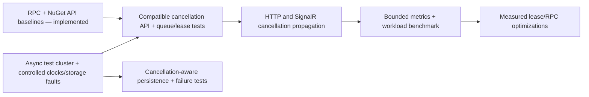

# .NET and Orleans modernization review

Date: 2026-09-07. Baseline: `05bccaf` (127 tests, 93.34% coverage).

## Scope and execution plan

Compare this library's architecture and implementation with .NET 10 and Orleans
10.3.1 using upstream release notes, documentation, source, and installed packages.
Prioritize compatibility, cancellation, grain scheduling/persistence, testing, and
observability. Adopt the built-in RPC contract analyzer now without changing RPC
identities or method signatures; enable .NET package baseline validation against
published 10.1.0 and produce a ranked modernization plan for behavior changes. Do not introduce a new framework, storage provider, or breaking API as a
side effect of review. Use dotnet/orleans for API evidence and analyzer-config for
build policy. Verify missing-manifest failure, generate manifests with the official
code fix, prove that an intentional method-signature mutation fails the build,
restore it, then run build/analyze, format, and the existing tests/CI.

## Decision

Keep the Core / Client / Server boundary and one stateful grain per quota key.
The distributed coordinator still provides value beyond a process-local ASP.NET
Core limiter. .NET 10, C# 14, Orleans 10.3.1, central package management, generated
serializers, TUnit, and Microsoft.Testing.Platform are already in place. Upstream
GitHub's release API confirms Orleans 10.3.1, published 2026-08-28; older cached
release pages can show 10.2.x. This review targets the installed release, not preview
APIs or descriptions from a different version.

## Prioritized improvements at the review baseline

Cancellation, persistence writes/clocks, asynchronous TestingHost, bounded metrics,
and token snapshot boundaries are now implemented. See
[implementation, compatibility and operational details](CancellationAndObservability.md).
The table below preserves the original evidence and acceptance criteria; the
benchmark-dependent lease/RPC optimization remains a separate performance design.

| Priority | Area and current evidence | Recommendation and acceptance criteria |
| --- | --- | --- |
| P1 | `Core/Interfaces/IRateLimiterGrain.cs`, `IRateLimiterGrainWithConfiguration.cs`, `Models/Holders/BaseRateLimiterHolder.cs`, and `GroupLimiterHolder.cs` have no cancellation path through acquisition. HTTP passes `RequestAborted` only while constructing the group; SignalR does not pass its connection cancellation to construction. | Add a compatible cancellable acquisition surface and flow the token through middleware, group, holder, grain locks, and `RateLimiter.AcquireAsync`. Retain existing RPC identities and old entry points. Test cancellation before dispatch, while queued, during partial group acquisition, and racing successful acquisition. Assert queue removal and restored concurrency capacity; cleanup must not use an already-cancelled request token. A caller-side `WaitAsync(token)` alone is insufficient because remote acquisition can still complete. |
| P1 — implemented | Orleans 10.3 adds an opt-in RPC contract compatibility analyzer. Previously the build could miss accidental changes to method or grain identities. | Enable it for Core and Server, check in generated `OrleansContracts.txt`, and promote Versioning diagnostics to errors in `.editorconfig`. Missing manifests and a controlled wire-ID mutation now fail compilation. Existing interfaces, attributes, wire IDs, and grain class IDs are unchanged. This guard does not prove behavioral or persisted-state compatibility. |
| P1 — implemented | `EnablePackageValidation` was enabled without a previous package baseline, so it did not compare public API across releases. | Set `PackageValidationBaselineVersion` to published 10.1.0 and run pack in PR CI. A controlled removal of `MetadataNames` fails with `CP0002`; restored Core, Client, and Server pass. The baseline is metadata-only `PackageDownload`, not a runtime dependency. |
| P2 | `RateLimiterGrain.Persistence.cs` uses parameterless storage methods and direct `DateTimeOffset.UtcNow`; shutdown and timer cancellation stop before the actual write. | Evaluate the new `IStorage` cancellation overloads for timer/shutdown writes. First add a cancellable/failing provider test, including retention of dirty state after failure. Keep the state lock: runtime serialization of storage calls does not make our multi-step snapshot/dirty-flag mutation atomic. Provider fallback implementations can still ignore cancellation. |
| P2 | `Tests/Cluster/TestClusterApplication.cs` synchronously deploys `TestCluster`; tests use wall-clock waits and activation collection. | Move fixture startup to asynchronous `InProcessTestClusterBuilder`/deployment in an isolated test-infrastructure change. Use Orleans' per-area time-provider helpers to control grain time without accelerating membership/background services. Add cancellation, restart, and write-failure tests. The native .NET limiters still own their clocks, so injecting a fake clock into Orleans alone does not make every limiter wait deterministic. Measure suite duration before claiming a speedup. |
| P2 | `RateLimiterGrain.cs` retains successful native leases for all algorithms and disposes them through a later RPC. Only concurrency leases return capacity on disposal. | Benchmark a release-free path for fixed/sliding/token algorithms, keeping concurrency ownership unchanged. Measure retained objects, RPCs/request, allocations, and latency before adopting it. Review LeaseId semantics and old-client disposal compatibility; do not silently reinterpret a public metadata field solely as a performance edit. |
| P2 | Logging exists, but the package does not publish its own acquisition/queue/flush metrics. Orleans 10.3 changed RPC activity tags. | Add a bounded-cardinality `System.Diagnostics.Metrics` meter for allowed/rejected/cancelled acquisitions, queue duration, active concurrency permits, and storage flush failures. Tag algorithm and outcome; never raw user, IP, tenant, or grain keys. Test counters with `MeterListener`; update consumer telemetry queries to current Orleans tags. Avoid bundling a dashboard or telemetry backend into the library. |
| P2 | Persisted quotas are aggregate snapshots with an update timestamp. Fixed/sliding restoration is conservative and abrupt crashes can lose unflushed changes. | Keep the documented best-effort rate-limit semantics. Add boundary tests for replenishment, clock movement, extreme arithmetic, and rolling upgrades with persisted state. Exact sliding-segment restoration or crash-durable billing requires a separate versioned state design and performance budget; new journaling/transaction APIs do not provide that automatically. |

The implementation adds separate optional cancellation capabilities while retaining
old RPCs and holder interfaces. Updated silos must precede callers of the new RPCs.
Cluster-wide timeout defaults remain unchanged. The API baseline and generated RPC
manifest diff check compatibility; they do not prove arbitrary mixed-version deployment.

## Version-specific evidence

### Native cancellation: use the runtime contract, not a timeout assumption

Orleans supports standard `CancellationToken` on grain calls. In the **10.3.1
source**, `MessagingOptions.CancelRequestOnTimeout` defaults to `false`. The Learn
cancellation page still describes a default of `true` in its timeout section.
Prefer the tagged source for the installed release. Our holder catches
`TimeoutException` and returns rejection, but that does not by itself remove a
remote queued acquisition. Even explicit cancellation is cooperative and requires
observing the token and handling acquisition/response races.

Sources: [cancellation API](https://learn.microsoft.com/en-us/dotnet/orleans/grains/cancellation-tokens),
[10.3.1 MessagingOptions](https://github.com/dotnet/orleans/blob/v10.3.1/src/Orleans.Core/Configuration/Options/MessagingOptions.cs).

### Contract protection is a useful new capability to adopt immediately

The 10.3.1 analyzer regenerates manifests project-wide, records effective RPC
identities, retains retired declarations, and detects drift. It is disabled unless
`EnableOrleansContractsAnalyzer` is set. Core and Server now opt in; Client has no
owned grain contracts, and the test-only contracts are intentionally outside the
published compatibility baseline. No analyzer dependency was added because the
existing Orleans packages already supply it.

Source: [10.3.1 compatibility analyzer guide](https://github.com/dotnet/orleans/blob/v10.3.1/docs/site/src/content/docs/grains/grain-versioning/contract-compatibility-analyzer.md).

### .NET package validation closes a different compatibility gap

The SDK's baseline package validator is an existing capability, not a new .NET 10
API. It complements RPC identity checks by comparing public/protected .NET members
with the published package. Adding an optional parameter can still be a binary
break, which is particularly relevant to future cancellation APIs. Keep original
methods and use a reviewed additive/versioned design.

Source: [baseline package validator](https://learn.microsoft.com/en-us/dotnet/fundamentals/apicompat/package-validation/baseline-version-validator).

### Persistence and testing gained APIs, but host policy still matters

Orleans 10.3 adds cancellation-aware/concurrency-safe persistent-state operations.
`IStorage` retains parameterless APIs and adds token overloads with compatibility
fallbacks. TestingHost exposes `InProcessTestClusterBuilder` and
`UseTimeProviderForBackgroundAreas`; use the actual public type names rather than
inferring them from source filenames. `TimeProvider` itself predates .NET 10.

Sources: [storage contract](https://github.com/dotnet/orleans/blob/v10.3.1/src/Orleans.Core.Abstractions/Core/IStorage.cs),
[test builder](https://github.com/dotnet/orleans/blob/v10.3.1/src/Orleans.TestingHost/InProcTestClusterBuilder.cs),
[clock isolation helper](https://github.com/dotnet/orleans/blob/v10.3.1/src/Orleans.TestingHost/TimeProviderTestingExtensions.cs).

### Current architecture choices to retain

- `IPersistentState<T>` and generated serializers are the supported building blocks.
  Keep storage-provider selection in the consuming host. Orleans 10.3's stricter
  JSON type allow-list needs provider-level migration tests; do not turn on
  `AllowAllTypes` to avoid those tests.
- `RegisterGrainTimer` with `KeepAlive = false` fits activation-local batched flushes.
  Durable reminders/jobs would change lifecycle and storage cost. They are useful
  for durable scheduled business work, not a mandatory replacement for this timer.
- `[AlwaysInterleave]` permits releases to progress while acquisitions queue. Do not
  mark the entire grain reentrant or remove synchronization without proving the
  configuration/acquisition/flush invariants.
- Orleans' current placement/directory improvements are already obtained through
  the runtime update. Do not add custom placement or sharding before measuring a
  hot shared key; naive sharding would multiply the effective quota.
- TUnit + Shouldly + Microsoft.Testing.Platform remains the repo's test stack.
  Upstream Orleans using xUnit internally is not a reason to migrate this library.
- Built-in ASP.NET Core rate limiting is useful as a local admission layer. A
  transparent distributed `RateLimiter` adapter needs an explicit design for its
  synchronous fast path; never introduce sync-over-async Orleans calls to fit it.

Sources: [Orleans 10.3 release notes](https://github.com/dotnet/orleans/releases/tag/v10.3.0),
[timer semantics](https://learn.microsoft.com/en-us/dotnet/orleans/grains/timers-and-reminders),
[.NET 10 library changes](https://learn.microsoft.com/en-us/dotnet/core/whats-new/dotnet-10/libraries).

## Adoption sequence

## Verification and boundaries

The missing manifest produced `ORLEANS0020` as an error. The manifests were
regenerated by the upstream code fix, not hand-authored. An intentional temporary
RPC ID change produced `ORLEANS0018`; source was restored immediately afterward.
This proves the configured gate actually rejects wire-identity drift. Regeneration
changed only the manifests, with no source identity edits.

CLI bootstrap detail: on this SDK, the initial format operation did not persist a
new AdditionalFile. Creating the empty destination first allowed the official code
fix to populate it. The checked-in manifests make subsequent regeneration normal.
Review generated diffs instead of regenerating baselines automatically in CI.

This is a repository and upstream-API review. The ranked items above are proposed
follow-up slices, not claims that cancellation, metrics, exact durability, or a
new test host have already been implemented. Production hosting/provider behavior
and throughput have not been benchmarked in this review.

Local verification: all 127 tests passed after enabling the Orleans guard. Build
and analyzer builds have zero warnings/errors, format verification passes, all
three packages pass the published 10.1.0 API baseline, and `actionlint` passes.
The two mutation controls failed for the intended diagnostic (`ORLEANS0018` and
`CP0002`) and all temporary source changes were restored. Production behavior was
not changed in this modernization pass; the prior full coverage result is 93.34%.
GitHub CI additionally runs the full suite and coverage for the final pushed SHA.
