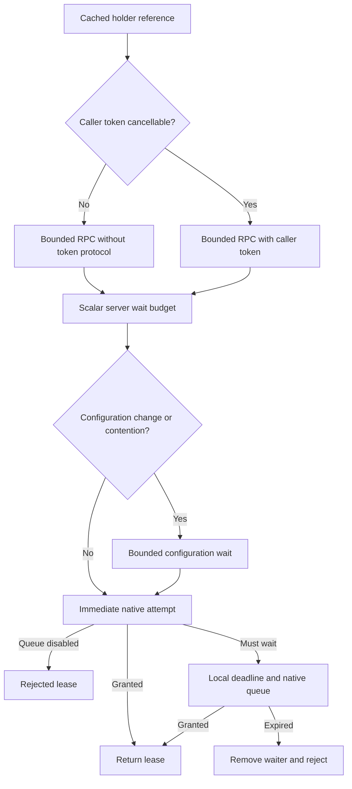

# Performance and timeout validation

## Scope

Baseline: `705b47d`. This work addresses acquisition/release throughput, p99 latency,
allocations, abandoned lease retention and bounded queue/configuration waits. Measured
performance takes priority over compatibility scaffolding. The immediate acquisition
path must not create client deadline timers or force distributed cancellation for a
caller whose token cannot be cancelled. No runtime dependency is added.

## Server-enforced budgets and the fast path

`AddOrleansRateLimiting` registers a timeout provider. The generated bounded grain proxy
uses it to supply a scalar `TimeSpan` budget before dispatch. It uses 80% of the explicit request response timeout or
hosting runtime response timeout, reserving headroom before Orleans expires the callback.
A caller-supplied shorter budget is preserved. Client/service-collection registration
is idempotent; co-hosted applications use one silo provider regardless of registration order.
The provider is resolved once when the reference is constructed. No global outgoing
filter, per-call service lookup, timer or linked cancellation source is introduced.

The proxy uses Orleans' public `GenerateMethodSerializers` and `DefaultInvokableBaseType`
extension points. This preserves the runtime's direct dispatch path for calls without
filters, including release and unrelated grain calls. A global filter would force all
of them through an additional invoker and asynchronous pipeline; see the
[Orleans 10.3.1 dispatch implementation](https://github.com/dotnet/orleans/blob/v10.3.1/src/Orleans.Core/Runtime/GrainReferenceRuntime.cs).
The proxy's non-generic forwarding overload is required by source-generator validation;
bounded acquisition contracts themselves all return metadata through the generic overload.

Holders cache their bounded grain reference. `CancellationToken.None` and overloads
without a token use RPCs without a cancellation argument. Cancellable callers use the
native Orleans token path, preserving HTTP abort and SignalR disconnect propagation.
The server first tries an immediate acquisition. If quota is available, the steady-state
path uses no deadline timer. A disabled native queue rejects immediately too. Timed
semaphore waits, queued acquisitions and configuration replacement establish timeout
machinery only on those slower paths. Queue success preserves the library's counters.

A monotonic server clock tracks the remaining budget across configuration and acquisition.
A queue timeout removes its native waiter locally, without depending on a subsequent
client cancellation message. A cancelled configuration wait cannot reset quota. An expired
budget cannot acquire or replace configuration. Late acquired concurrency permits are
released before the server reports expiration. Holder deadlines return rejected leases;
caller cancellation remains `OperationCanceledException`.

The relative budget starts when the server method runs. Activation/routing time is still
part of Orleans' separate client response timeout, so this is not a globally synchronized
absolute deadline. Atomic state mutation and providers which ignore cancellation cannot
be forcibly interrupted. Network partitions, lost replies and client crashes do not gain
a distributed concurrency-lease expiry guarantee. Concurrency permits still need explicit
release, and persistence retains its best-effort snapshot boundary.

The original queue leak was reproduced using a one-second response timeout with
`CancelRequestOnTimeout=false`. Cancelling only after `TimeoutException` is too late for
Orleans' removed callback registration; see the
[10.3.1 callback implementation](https://github.com/dotnet/orleans/blob/v10.3.1/src/Orleans.Core/Runtime/CallbackData.cs#L140).
Global Orleans timeout/cancellation defaults and unrelated grain calls are unchanged.



## Lease allocation and release

Known fixed-window, sliding-window and token-bucket native leases do not refund quota
on disposal. Their grains dispose the native lease immediately and add metadata field 4,
`IsReleaseOptional=true`, retaining a non-empty lease id. Updated clients omit the release
RPC, and abandoned time-based leases no longer accumulate in a server dictionary.
Concurrency and custom base-grain implementations default to explicit release.

Holders reuse their existing grain reference for concurrency release when the returned
owner id matches, avoiding a second grain-reference lookup/cast per operation. Publicly
constructed leases and different returned owner ids retain the factory-based fallback.
Empty metadata uses a shared immutable dictionary instead of allocating a dictionary for
every successful lease.

All 10.2 holder acquisitions require the bounded capability; deploy updated silos before
updated clients. Existing RPC identities remain available, with direct quota/ownership
regressions. Old metadata without field 4 still requires release. Tests read an actual
baseline payload; a separate unmodified-baseline assembly probe also read the new field
successfully. Core-only holder construction needs Client/Server registration for an
automatically supplied budget. Direct legacy RPCs do not carry that budget.
Custom grain implementations used with built-in 10.2 holders must implement the generic
bounded capability as well; there is no runtime fallback to an unbounded legacy RPC.

## Reproduce the measurements

Performance source is opt-in. Ordinary test builds exclude `Performance/**/*.cs`.
Run without coverage instrumentation and serialize benchmark/build/test commands:

```sh
dotnet build ManagedCode.Orleans.RateLimiting.sln -c Release -p:RunPerformanceTests=true
RATE_LIMIT_PERFORMANCE_OUTPUT=/tmp/rate-performance.json dotnet test \
  --project ManagedCode.Orleans.RateLimiting.Tests/ManagedCode.Orleans.RateLimiting.Tests.csproj \
  -c Release --no-build -p:RunPerformanceTests=true \
  --treenode-filter '/*/*/PerformanceBenchmarkTests/*'
```

Set `RATE_LIMIT_PERFORMANCE_ALGORITHM=concurrency` for an isolated concurrency comparison.
Also set `RATE_LIMIT_PERFORMANCE_CALLER_TOKEN=true` to measure a real cancellable token.
That lane reuses a caller-owned token source per case, measuring library/RPC costs without
including construction of a new caller token source in every operation. The token is not
cancelled during throughput measurement; functional tests exercise actual cancellation.
Set `RATE_LIMIT_PERFORMANCE_WARM_WORKLOAD=true` to additionally execute a complete
unmeasured repetition with the same worker count and disposal behavior before measurement.
The JSON `WarmWorkload` flag records this; reports predating that flag used only the
per-holder sequential warm-up described below.

Rebuild without `RunPerformanceTests` before ordinary tests or coverage. Export `705b47d`
into a separate directory and copy only the identical `Performance` source and its
conditional compile item for baseline comparison. Restore/build/test consistently under
the canonical `/private/tmp/...` path on macOS. An archive has expected SourceLink warnings
because it lacks Git metadata; the real checkout must still build without warnings.

The harness uses a dedicated two-silo in-process Orleans fixture, memory persistence
and a 50 ms snapshot flush period. Only silo 0 exposes a gateway, verified through the
actual gateway provider. Placement hints activate every measured grain on silo 0; the
hint is removed before warm-up. The harness asserts placement before and after every
repetition. Sixteen partitions therefore measure sixteen grains on the same silo. This
keeps the RPC route identical across revisions instead of comparing random gateway hops. Each full-matrix case warms 4,096 operations per holder and
measures three repetitions of 32,768 successful acquisition/disposal operations. Scenarios
are sequential, 16 workers on one key, and 16 workers on separate keys. The separate
abandoned time-lease scenario skips disposal. Isolated concurrency cases warm 65,536
operations on a single key, retaining 4,096 per holder for the partitioned scenario.

JSON `Cancellable` selects the overload; `TokenCanBeCanceled` distinguishes an actual
cancellable token from `CancellationToken.None`. Reports retain all repetitions, ops/s,
p50/p95/p99 latency, process allocated bytes per operation, retained bytes after full GC,
and GC collection counts. Allocation includes Orleans, the fixture and background storage.
Retained deltas include pooling/background activity, so negative deltas are possible.

These are local measurements on a shared development machine, without confidence intervals
or a production network/storage provider. Timing varies; RPC counts, avoided per-request
objects, queue cleanup and quota assertions provide additional deterministic evidence.

## Initial iteration measurements

The reports in this section measure `b6efd7e`, the scalar-budget implementation before
moving budget injection out of the global filter into the bounded proxy. They document
the reason for the final proxy change. Use the latest isolated CI run for final-code results.

Medians of three repetitions on .NET 10.0.11, macOS 26.6.2, arm64 (12 logical processors).
Baseline is `705b47d`; updated is this change. The full matrix uses the same verified
single-gateway route and placement for both revisions. These are observed differences,
not statistically established capacity guarantees.

| Algorithm / 16 workers on one key | Overload | Baseline ops/s | Updated ops/s | Change | p99 baseline → updated (ms) | Allocated B/op baseline → updated |
| --- | --- | ---: | ---: | ---: | ---: | ---: |
| concurrency | No token | 58,367 | 60,579 | +3.8% | 1.202 → 0.918 | 6,583 → 6,535 |
| concurrency | Token.None | 57,873 | 59,655 | +3.1% | 1.263 → 1.043 | 9,199 → 6,315 |
| fixed | No token | 58,693 | 103,855 | +76.9% | 1.257 → 0.437 | 6,098 → 3,877 |
| fixed | Token.None | 59,844 | 105,938 | +77.0% | 1.206 → 0.372 | 9,278 → 3,757 |
| sliding | No token | 62,441 | 106,058 | +69.9% | 0.997 → 0.378 | 6,503 → 3,761 |
| sliding | Token.None | 58,425 | 106,600 | +82.5% | 1.153 → 0.366 | 9,266 → 3,797 |
| token | No token | 62,187 | 111,312 | +79.0% | 0.971 → 0.331 | 6,362 → 3,739 |
| token | Token.None | 62,216 | 109,350 | +75.8% | 1.008 → 0.287 | 9,280 → 3,835 |

The separate real-caller-token concurrency lane measured hot-key throughput
59,913 → 62,137 ops/s (+3.7%), p99 1.112 → 0.908 ms and allocated bytes/operation
9,645 → 6,682. Sequential throughput was +0.9%; partitioned throughput was +9.8%.

The isolated concurrency lane had an anomalously slow baseline hot-key median
(32,995/31,533 ops/s versus 58,367/57,873 in the full matrix). Its apparent 91–100%
improvement is **not** used as the expected performance gain. Its raw results are
retained so this run-to-run variation remains visible.

The full matrix also contains regressions: sequential concurrency with `Token.None`
was -8.9% (the isolated lane was +11.8%); abandoned fixed/sliding leases without a token
were -17.7%/-7.8%. Abandoned leases intentionally skip disposal and omit the release-RPC
saving. These observations prevent a claim that every scenario improved. The abandoned
case also checks retained memory, while functional tests prove that time-based leases
no longer require release and still consume quota.

Repeating the full matrix in reversed revision order retained the strong time-limiter
gains, but concurrency timing remained variable: hot-key throughput was -3.2%/+3.3%
for no-token/`Token.None`, sequential -22.5%/-20.9%, and partitioned -0.6%/-25.0%.
The first measured workload used only sequential warm-up, including before parallel
cases. These results prompted the additional workload-warmed ABBA validation below;
they are retained rather than discarded.

The local workload-warmed ABBA lane still varied: no-token hot-key throughput was -9.0%
and sequential -29.5%, while `Token.None` hot-key was +3.7% and sequential +15.1%.
During this lane, the machine reported load averages 29.36/28.81/20.48 with 12 logical
CPUs; unrelated browser tests, Chromium and a Gateway process were active. Those user
processes were left running. These contended measurements cannot establish either a
reliable speedup or the absence of regressions. The isolated CI comparison below is the
release assessment lane; local timings are diagnostic observations.

Warmed raw samples: [baseline A](performance/2026-09-07-warmed-0-baseline.json),
[updated B](performance/2026-09-07-warmed-1-updated.json),
[updated B repeat](performance/2026-09-07-warmed-2-updated.json),
[baseline A repeat](performance/2026-09-07-warmed-3-baseline.json).

All repetitions, including unfavorable results:

- [Full matrix baseline](performance/2026-09-07-baseline.json) and [updated](performance/2026-09-07-updated.json).
- [Isolated concurrency baseline](performance/2026-09-07-concurrency-baseline.json) and [updated](performance/2026-09-07-concurrency-updated.json).
- [Real caller token baseline](performance/2026-09-07-caller-token-baseline.json) and [updated](performance/2026-09-07-caller-token-updated.json).
- [Reversed full matrix baseline](performance/2026-09-07-repeat-baseline.json) and [updated](performance/2026-09-07-repeat-updated.json).

## Isolated CI comparison

The first [isolated run](https://github.com/managedcode/Orleans.RateLimiting/actions/runs/34155639259)
tested `b6efd7e` on a four-CPU Ubuntu 24.04 runner with .NET 10.0.11. No-token hot-key
throughput matched baseline (+0.3%, p99 1.316 → 1.279 ms), but the `CancellationToken.None`
overload still lost 8.4% throughput. Real cancellable-token hot-key throughput was -2.8%.
This remaining cost prompted replacement of the global filter with the bounded proxy.
The full first-run data is retained in `performance/2026-09-07-first-ci-*.json`.

Manually dispatch the existing `CI` workflow on the feature branch. Its performance job
uses its own Ubuntu runner, separate from functional tests and coverage. The baseline
is pinned in `BASELINE_REF` to the pre-change commit; update that reviewed value when
establishing a future release baseline.

Validation sequence:

1. Export baseline production sources with `git archive` and copy only the current benchmark harness.
2. Build both revisions without coverage instrumentation; expected archive SourceLink warnings do not affect the benchmark.
3. Run concurrency baseline → updated → updated → baseline on that one runner. Each sample
   exercises both `CancellationToken.None`/no-token overloads and a real cancellable caller token,
   with exact-workload warm-up and verified gateway/placement.
4. Aggregate all six measured repetitions per case using `scripts/summarize-performance.py`.
   Review throughput, p99 and allocation together; no samples are removed and no timing-based
   pass threshold masks a regression.
5. Publish the comparison in the job summary and every raw JSON in the
   `performance-comparison` artifact (30 days). Exact-run results accompany the PR checks.

Run with `gh workflow run ci.yml --ref codex/security-rate-limit-10-2` for this release.
Linux runner numbers are compared within that runner, never directly to the macOS values above.


## Verification

- 187/187 ordinary tests pass, without skips; this follow-up adds 38 to the 149-test baseline.
  Coverage instrumentation also passes all 187 tests.
- Total line coverage is 93.78% (Client 93.77%, Core 94.24%, Server 93.25%); the 85% gate
  is unchanged. Timeout providers have 100% coverage. Acquisition, deadline, holder
  cancellation and lease files remain above 90%.
- The 16 timeout storms each queue 16 requests across all four algorithms, both overload
  choices and configured/unconfigured calls. They complete in 800.9–810.0 ms against a
  one-second client response timeout with `CancelRequestOnTimeout=false`. All queues
  empty, and concurrency capacity remains available afterward. The separate silo-origin
  case uses its 500 ms messaging timeout.
- Regressions cover queued success/counters, expired configuration replacement, an
  explicitly expired budget, actual cancellable-RPC selection, release RPC counts,
  older metadata and both legacy configuration-RPC overloads.
- Release/analyzer builds have zero warnings/errors. Ordinary and opt-in benchmark
  formatting pass. Direct/transitive NuGet vulnerability audit and actionlint pass.
- All three 10.2.0 packages and symbols pack successfully, including public API validation
  against published 10.1.0. Published RPC identities are retained. The new bounded proxy
  and its invoker identities are introduced together in the unpublished 10.2 release;
  intermediate branch builds are not a rolling-upgrade compatibility baseline.

### Generated-proxy coverage exception

`BoundedRateLimiterGrainReference` has 80% line coverage: its required non-generic
forwarding overload is unreachable from the registered bounded interfaces, which all
return metadata. Every sequence point on their constructor/generic dispatch path is
covered by real RPC tests. The forwarding line remains included in total coverage;
there are no exclusions or weaker assertions. This narrow exception avoids adding an
artificial public RPC solely to execute generator scaffolding. Remove the overload and
exception when Orleans' proxy validation accepts inherited dispatch overloads.
