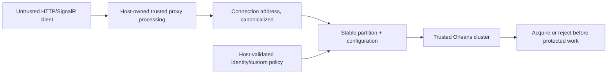

# Security review: 10.2.0

Date: 2026-09-07. Baseline: `e6db662` (10.1.0).

## Scope and delivery plan

Fix GHSA-mfr4-hpp8-752w and reproducible adjacent rate-limit bypasses; review
HTTP/SignalR identity extraction, partition isolation, holder accounting, lease
lifecycle, grain configuration/persistence, and dependency advisories. Update all
central NuGet and local tool pins to the latest stable versions and bump the
package minor version. No new runtime dependencies or grain interface changes.

Verification order: failing regression tests, focused security tests, complete
TUnit suite, Release build/analyze, `dotnet format` verification, coverage with the
existing 85% gate, NuGet vulnerability/outdated audit, package creation, diff
review, then authorized commit/push. Use the dotnet/orleans/project-setup skills
for implementation and format/quality-ci/complexity guidance for final checks.
Complexity remains governed by root AGENTS.md limits; this repo has no configured
CA1502/CodeMetricsConfig gate. New test classes and methods remain within those
limits. Existing oversized grain partials are outside this change.

## Fixed findings

| ID | Impact and trigger | Correction and evidence |
| --- | --- | --- |
| SEC-01 / GHSA-mfr4-hpp8-752w | High: rotating untrusted forwarded IP headers gives a fresh HTTP limiter partition. | Parameterless IP resolution uses only `Connection.RemoteIpAddress`. Real TestServer requests through all five HTTP modes exercise three spoofed header names, multiple values, and real Orleans quota enforcement. Trusted-proxy and unknown-proxy tests exercise standard ASP.NET Core forwarding. |
| SEC-02 | IP limits could be skipped when a transport supplies no connection address; mapped/native IPv4 representations split identity. | A shared `unknown-ip` fallback keeps IP limiting active; normalize IPv4-mapped IPv6. HTTP and real SignalR reconnection tests cover missing addresses and forged headers; a resolver test covers mapped IPv4. |
| SEC-03 | Missing attribute configuration silently allowed protected HTTP endpoints to run. | Throw `RateLimitConfigurationNotFoundException` before endpoint execution. Tests cover IP, anonymous, authorized, and role attributes. |
| SEC-04 | The holder overload receiving a permit count and null options acquired one permit regardless of the requested cost. | Forward the requested permit count to acquisition. Test all four limiter types against real grains, assert no quota remains and the next acquisition is rejected. |
| SEC-05 | Stacked IP and anonymous HTTP attributes with different configurations selected the same grain, repeatedly resetting each other's quotas. | Include a normalized configuration name in the HTTP attribute grain key. A combined-attribute endpoint must reject its second request despite the different permit limits. |

## Trust boundaries and migration

- Configure `KnownProxies`/`KnownIPNetworks` and a bounded `ForwardLimit` in the
  consumer app; run forwarded headers before authentication/rate limiting.
  Do not enable blanket forwarding from arbitrary clients. The legacy explicit
  `GetClientIpAddress(headers)` overload preserves compatibility and requires the
  caller to independently establish header trust. No built-in integration uses it.
- HTTP attribute keys now include configuration identity. Old keys are not migrated;
  rollout starts new counters for those policies. Changing raw-header defaults
  likewise moves affected clients to their connection-derived partition. Deploy
  all application nodes consistently to avoid splitting quotas between versions.
- Authentication and authorization remain the consuming application's responsibility.
  Optional user/group/tenant/custom rules intentionally skip absent keys; mark them
  required where necessary and combine them with IP/shared limits for anonymous
  traffic. Do not derive trusted identities from unchecked request headers.
- Core grain APIs, including configure, reset, delete, manual replenishment, and
  lease release, assume trusted cluster callers. Do not expose them as arbitrary
  public HTTP operations. Lease IDs are capabilities and must remain server-side.
- Composite key escaping already protects `:` and `%` boundaries. Existing
  collision tests remain in the suite. Custom metadata cardinality and policy
  selection are controlled by the host; use stable authenticated keys and combine
  per-identity limits with shared limits to bound abuse from many identities.
- Group disposal and middleware `await using` release acquired concurrency leases;
  rejection and timeout paths fail closed. Persistent concurrency leases require
  eventual disposal by trusted callers. Quota snapshots flush periodically, so an
  abrupt silo crash can lose the latest unflushed quota. This is an existing
  availability/durability tradeoff, not an exact durable billing ledger.

This is a source review and local integration verification, not a production
penetration test or a guarantee that no other vulnerabilities exist. The private
advisory itself is not published or modified by this change.

## Dependencies

Latest stable NuGet registry versions were checked for every central pin and local
tool. Updated 20 central package pins and all three local tools. Orleans is 10.3.1,
Microsoft runtime/test-host packages are 10.0.11, TUnit is 1.66.27. Three central pins
were already current. NuGet reported no outdated direct packages and no known
vulnerable direct/transitive dependencies after restore.

## Verification

Status: complete for local verification on .NET SDK 10.0.400 (macOS arm64).

- Regression evidence: the first 14 security cases failed before their corrections;
  the separate stacked-policy regression also failed before configuration key isolation.
- Focused final security suite: 17 passed, 0 failed, 0 skipped.
- Complete final suite under Coverlet: 89 passed, 0 failed, 0 skipped (2m 24s).
- Earlier complete suite before the final isolated-key correction: 88 passed.
- Release build and analyzer build: 0 warnings, 0 errors.
- `dotnet format ManagedCode.Orleans.RateLimiting.sln --verify-no-changes`: passed.
- Coverage: 92.17% total lines (85% gate), 75.93% branches, 93.49% methods.
  Client: 93.75%; Core: 92.03%; Server: 91.51% line coverage.
- Coverage report generated successfully with the updated ReportGenerator tool.
- NuGet audits: no outdated direct packages; no known vulnerable direct/transitive packages.
- Pack: Core, Client, and Server 10.2.0 packages and symbol packages created successfully.
- Diff whitespace and documentation links checked. No production deployment or
  NuGet publication is part of this local verification snapshot.

Commands are the root AGENTS.md commands. Focused tests additionally use
`--treenode-filter '/*/*/*SecurityTests/*'`. Source review and fixes used the
Orleans skill; package/tool updates used project-setup; formatting followed format;
quality-ci/complexity guidance was applied without adding or lowering quality gates.
No remaining local verification failures.
