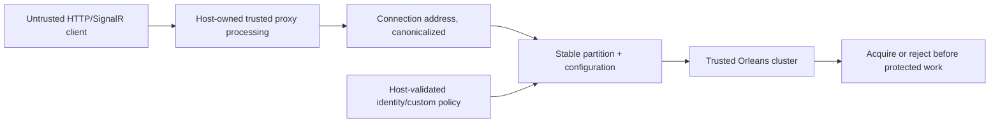
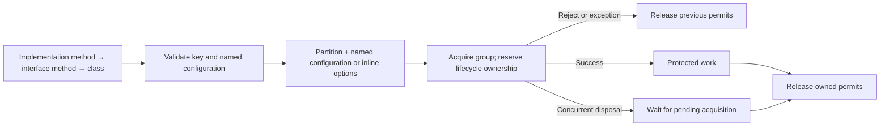
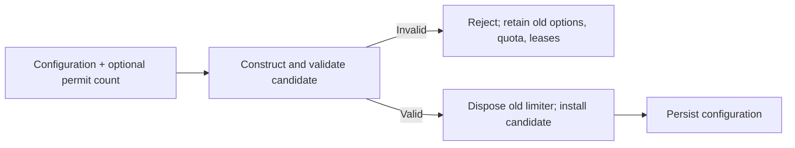

# Security review: 10.2.0

Date: 2026-09-07. Baseline: `e6db662` (10.1.0).

## Scope and delivery plan

Fix GHSA-mfr4-hpp8-752w and reproducible adjacent rate-limit bypasses; review
HTTP/SignalR identity extraction, partition isolation, holder accounting, lease
lifecycle, grain configuration/persistence, and dependency advisories. Update all
central NuGet and local tool pins to the latest stable versions and bump the
package minor version. No new runtime dependencies or grain interface changes.

Verification order: failing regression tests, focused security tests, complete
TUnit suite, Release build/analyze, `dotnet format` verification, coverage with the
existing 85% gate, NuGet vulnerability/outdated audit, package creation, diff
review, then authorized commit/push. Use the dotnet/orleans/project-setup skills
for implementation and format/quality-ci/complexity guidance for final checks.
Complexity remains governed by root AGENTS.md limits; this repo has no configured
CA1502/CodeMetricsConfig gate. New test classes and methods remain within those
limits. Existing oversized grain partials are outside this change.

## Fixed findings

| ID | Impact and trigger | Correction and evidence |
| --- | --- | --- |
| SEC-01 / GHSA-mfr4-hpp8-752w | High: rotating untrusted forwarded IP headers gives a fresh HTTP limiter partition. | Parameterless IP resolution uses only `Connection.RemoteIpAddress`. Real TestServer requests through all five HTTP modes exercise three spoofed header names, multiple values, and real Orleans quota enforcement. Trusted-proxy and unknown-proxy tests exercise standard ASP.NET Core forwarding. |
| SEC-02 | IP limits could be skipped when a transport supplies no connection address; mapped/native IPv4 representations split identity. | A shared `unknown-ip` fallback keeps IP limiting active; normalize IPv4-mapped IPv6. HTTP and real SignalR reconnection tests cover missing addresses and forged headers; a resolver test covers mapped IPv4. |
| SEC-03 | Missing attribute configuration silently allowed protected HTTP endpoints to run. | Throw `RateLimitConfigurationNotFoundException` before endpoint execution. Tests cover IP, anonymous, authorized, and role attributes. |
| SEC-04 | The holder overload receiving a permit count and null options acquired one permit regardless of the requested cost. | Forward the requested permit count to acquisition. Test all four limiter types against real grains, assert no quota remains and the next acquisition is rejected. |
| SEC-05 | Stacked IP and anonymous HTTP attributes with different configurations selected the same grain, repeatedly resetting each other's quotas. | Include a normalized configuration name in the HTTP attribute grain key. A combined-attribute endpoint must reject its second request despite the different permit limits. |

## Trust boundaries and migration

- Configure `KnownProxies`/`KnownIPNetworks` and a bounded `ForwardLimit` in the
  consumer app; run forwarded headers before authentication/rate limiting.
  Do not enable blanket forwarding from arbitrary clients. The legacy explicit
  `GetClientIpAddress(headers)` overload preserves compatibility and requires the
  caller to independently establish header trust. No built-in integration uses it.
- HTTP attribute keys now include configuration identity. Old keys are not migrated;
  rollout starts new counters for those policies. Changing raw-header defaults
  likewise moves affected clients to their connection-derived partition. Deploy
  all application nodes consistently to avoid splitting quotas between versions.
- Authentication and authorization remain the consuming application's responsibility.
  Optional user/group/tenant/custom rules intentionally skip absent keys; mark them
  required where necessary and combine them with IP/shared limits for anonymous
  traffic. Do not derive trusted identities from unchecked request headers.
- Core grain APIs, including configure, reset, delete, manual replenishment, and
  lease release, assume trusted cluster callers. Do not expose them as arbitrary
  public HTTP operations. Lease IDs are capabilities and must remain server-side.
- Composite key escaping already protects `:` and `%` boundaries. Existing
  collision tests remain in the suite. Custom metadata cardinality and policy
  selection are controlled by the host; use stable authenticated keys and combine
  per-identity limits with shared limits to bound abuse from many identities.
- Group disposal and middleware `await using` release acquired concurrency leases;
  rejection and timeout paths fail closed. Persistent concurrency leases require
  eventual disposal by trusted callers. Quota snapshots flush periodically, so an
  abrupt silo crash can lose the latest unflushed quota. This is an existing
  availability/durability tradeoff, not an exact durable billing ledger.

This is a source review and local integration verification, not a production
penetration test or a guarantee that no other vulnerabilities exist. The private
advisory itself is not published or modified by this change.

## Dependencies

Latest stable NuGet registry versions were checked for every central pin and local
tool. Updated 20 central package pins and all three local tools. Orleans is 10.3.1,
Microsoft runtime/test-host packages are 10.0.11, TUnit is 1.66.27. Three central pins
were already current. NuGet reported no outdated direct packages and no known
vulnerable direct/transitive dependencies after restore.

## Verification

Status: complete for local verification on .NET SDK 10.0.400 (macOS arm64).

- Regression evidence: the first 14 security cases failed before their corrections;
  the separate stacked-policy regression also failed before configuration key isolation.
- Focused final security suite: 17 passed, 0 failed, 0 skipped.
- Complete final suite under Coverlet: 89 passed, 0 failed, 0 skipped (2m 24s).
- Earlier complete suite before the final isolated-key correction: 88 passed.
- Release build and analyzer build: 0 warnings, 0 errors.
- `dotnet format ManagedCode.Orleans.RateLimiting.sln --verify-no-changes`: passed.
- Coverage: 92.17% total lines (85% gate), 75.93% branches, 93.49% methods.
  Client: 93.75%; Core: 92.03%; Server: 91.51% line coverage.
- Coverage report generated successfully with the updated ReportGenerator tool.
- NuGet audits: no outdated direct packages; no known vulnerable direct/transitive packages.
- Pack: Core, Client, and Server 10.2.0 packages and symbol packages created successfully.
- Diff whitespace and documentation links checked. No production deployment or
  NuGet publication is part of this local verification snapshot.

Commands are the root AGENTS.md commands. Focused tests additionally use
`--treenode-filter '/*/*/*SecurityTests/*'`. Source review and fixes used the
Orleans skill; package/tool updates used project-setup; formatting followed format;
quality-ci/complexity guidance was applied without adding or lowering quality gates.
CI initially passed both full test runs but produced an empty coverage report
because deterministic PDB paths use `/_/`. The same behavior was reproduced
locally with `-p:ContinuousIntegrationBuild=true`. The workflow now passes a
source-root mapping to Coverlet, as documented in its
[path mapping guide](https://github.com/coverlet-coverage/coverlet/blob/master/Documentation/GlobalTool.md#path-mappings),
so instrumentation resolves the actual checkout without changing exclusions or
the coverage gate. A focused deterministic build verified all 17 security cases
and produced coverage for all three production modules. The SignalR test endpoint
also reads the live connection state to satisfy CA1822 while remaining an instance
hub method. The complete deterministic-build coverage run then passed all 89
tests and measured the same 92.17% line coverage. No remaining local verification
failures.

## Follow-up review: grain policies and lease ownership

Baseline: `152ba74`. The first pass added 17 security cases in four files. This
follow-up adds 22 cases in three further test classes, including real Orleans
calls and deterministic coordination of real concurrency leases. Package version
remains 10.2.0 because this release branch has not been published.

| ID | Confirmed issue | Fix and regression evidence |
| --- | --- | --- |
| SEC-06 | Grain call filters used the same limiter identity for different named or inline configurations. Alternating protected operations reset time quotas or released an in-flight concurrency permit. | Named keys include the normalized configuration name. Inline keys encode all relevant options, while identical inline options still share quota. Tests cover all four limiter kinds, including nested protected calls while a concurrency permit remains held. |
| SEC-07 | An explicit key partition without a key, or an explicitly empty configuration name, silently disabled grain call limiting. | Invalid keys throw before invoking application code; empty named configurations throw the existing configuration exception. Tests exercise all four limiter kinds. This closes misconfiguration-driven bypasses; these attributes are host-owned metadata. |
| SEC-08 | Rate-limit attributes on grain interface methods were ignored. | Resolve implementation-method attributes first, then interface-method attributes, then implementation-class attributes. Actual interface-declared calls are limited for all four algorithms. |
| SEC-09 | Overlapping group acquisition could overwrite a lease; disposal could complete before a pending lease arrived. An acquisition exception retained earlier permits until a later disposal. | Reserve group ownership before awaiting, disallow mutation during acquisition/ownership, roll back partial acquisitions on exceptions, and let every disposal caller await the same cleanup. Six lifecycle tests exercise real concurrency quotas using a gated response wrapper; no limiter outcomes are mocked. Rejected groups remain retryable after rollback. This is availability hardening for callers sharing or concurrently disposing groups, rather than a standalone anonymous HTTP exploit. |
| SEC-10 | Library exceptions lacked generated Orleans codecs. Rejected grain calls surfaced `CodecNotFoundException` instead of their intended exception and retry metadata. | Generate serializers with explicit member IDs for the three exception types. Round-trip tests serialize them polymorphically as `Exception` and assert retained reason, retry interval, configuration name, and partition kind. This repairs the rejection contract without relaxing admission. |

Migration: named and inline grain-attribute keys now start fresh counters, just
as the HTTP key correction did. Upgrade clients and silos consistently. Default
silo-option keys and externally implemented filter option types retain their
existing key behavior. No grain method signatures, runtime dependencies, or
persistence layouts changed. The serializers add previously missing wire support;
all communicating nodes should run the updated library to preserve typed errors.

Scope remains source review and local integration verification. Proxy trust,
authentication, high-cardinality custom keys, cluster administration, and abrupt
crash durability retain the boundaries described above. Configuration/update APIs
are trusted application capabilities. No claim is made of an exhaustive security
proof or production penetration test.

Follow-up verification:

- All 39 focused security cases passed; 22 were added in this follow-up.
- The full suite passed all 111 tests, with zero failures and zero skipped tests.
- Coverlet line coverage is 93.12% overall (Core 93.35%, Client 93.75%, Server
  92.44%). Policy-key construction and the three exception types have 100% line
  coverage; the changed filter and group holder meet the 90% critical-contract
  target. No thresholds or exclusions were weakened.
- Release build, analyzer build, formatting verification, coverage report, and
  packaging all passed. Build and analyzer output contain zero warnings/errors.
- NuGet audit reported no known vulnerable direct or transitive packages.
- Regression controls ran the new tests against the previous implementations:
  they reproduced policy bypasses, ignored metadata, lease leaks, and missing
  exception codecs before applying the fixes. The retry-after-rejection test also
  preserves an existing supported behavior.

## Completion review: rejected updates and workflow permissions

Baseline: `f6ed127`. Plan: reproduce failed configuration replacement and negative
permit-count side effects through all four real grain types, preserve the existing
limiter when input validation fails, then verify the focused and full suites,
coverage, analyzer build, formatting, and packages. Also fix the remaining CodeQL
`actions/missing-workflow-permissions` finding in the analysis workflow and replace
outdated Actions with current releases. Validate CI and CodeQL on the pushed SHA.
No public grain signatures, publishing triggers, package identities, or runtime
dependencies change. Configure/reset operations remain trusted application APIs;
the correction prevents invalid requests from corrupting their existing state.

| ID | Confirmed issue | Correction |
| --- | --- | --- |
| SEC-11 | Invalid configuration replacement disposed the working limiter before validating its replacement. Invalid permit counts could commit changed configuration and reset quota before rejecting acquisition. | Build and validate the candidate before disposing the old limiter; reject negative counts before configuration work. Sixteen real Orleans regression cases cover both update entry points and negative/excessive counts across all four algorithms, asserting retained configuration, exhausted quota, and concurrency lease ownership. All sixteen failed before the correction and passed afterward. |
| SEC-12 | CodeQL alert 5 identified implicit token permissions in the analysis workflow. CI also used deprecated Actions runtimes. | Set read-only workflow defaults and grant only contents read/security-events write to analysis jobs. Scan C# and Actions. Update official checkout/setup/artifact actions and Codecov, quote shell inputs, and pass dynamic release values/secrets through environment variables. Publishing conditions and behavior are unchanged. |

The existing protected factory reads candidate options synchronously; they are
restored in `finally` before any await. This preserves subclass signatures. The
existing oversized generic grain type remains a documented maintainability
exception; replacement logic is isolated in a new partial file of 50 lines.
Future work can split the remaining lifecycle partial without changing contracts.

Actions releases were verified against upstream releases:
[checkout 7.0.1](https://github.com/actions/checkout/releases/tag/v7.0.1),
[setup-dotnet 6.0.0](https://github.com/actions/setup-dotnet/releases/tag/v6.0.0),
[upload-artifact 7.0.1](https://github.com/actions/upload-artifact/releases/tag/v7.0.1),
[download-artifact 8.0.1](https://github.com/actions/download-artifact/releases/tag/v8.0.1),
and [Codecov 7.0.0](https://github.com/codecov/codecov-action/releases/tag/v7.0.0).

Verification for this completion pass: all 55 security cases and all 127 full-suite
tests passed, with zero failures or skipped tests. Coverlet line coverage is
93.34% overall (Client 93.75%, Core 93.50%, Server 92.91%). Release/analyzer builds,
format verification, coverage report, package creation, and `actionlint` passed.
Release-note scripts passed isolated dry runs for an initial release, a previous
revision, and a shell-shaped tag passed literally through the environment. No
publishing step was executed. GitHub reported zero open Dependabot alerts.
The remaining CodeQL alert is corrected in source; default-branch alert status
will only update after this branch is integrated and analyzed there.

## Modernization follow-up: cancellation and persistence boundaries

| ID | Confirmed issue | Correction |
| --- | --- | --- |
| SEC-13 | Queued limiter requests could continue after HTTP abort or SignalR disconnect because acquisition had no cancellation path. | Add optional cancellable RPC/holder capabilities, forward request/connection tokens through group ownership and grain locks into native queues, and release partial/late concurrency leases. Real HTTP, SignalR and four-algorithm queue tests verify cancellation and retained capacity. |
| SEC-14 | A failed persistent-state clear disposed the active limiter before storage confirmed deletion. | Clear storage before replacing the runtime, and mark state deleted only after success. An injected clear failure preserves state and active quota. |
| SEC-15 | Token-bucket snapshot restoration could overflow after a long outage or subtract permits when UTC moved backwards. | Clamp saved quota, ignore backwards elapsed time, and bound replenishment before multiplication. Deterministic boundary tests cover both failures and exact partial replenishment. |

A controlled return to the previous clear/restoration logic failed all three targeted
regression tests; the corrected implementation passes them. Dirty-state retry is
also exercised through an actual Orleans grain timer, a real memory provider with
an injected write failure, and an isolated controllable grain clock. Shutdown
cancellation is verified with a cancellable persistent-state test double.
See [implementation details and deployment order](CancellationAndObservability.md).

## Performance and timeout follow-up

| ID | Confirmed issue | Correction |
| --- | --- | --- |
| SEC-16 | An Orleans response timeout with `CancelRequestOnTimeout=false` rejected the caller while leaving the native acquisition queued. Cancelling only after the timeout is too late because Orleans has removed the callback's cancellation registration. | A scalar budget bounds native queues and configuration waits on the server. The configured fast path avoids client deadline timers and forced cancellation traffic; all 10.2 holders use the bounded capability. Eighteen real RPC tests cover client/silo calls and 16-request storms for all four algorithms, checking empty queues and returned concurrency capacity. The original queue-cleanup regression failed against the previous behavior. |
| SEC-17 | Time-based acquisitions retained native leases keyed by a fresh GUID until client disposal, even though disposal cannot replenish their quota. Clients which omitted disposal caused avoidable server retention. | Dispose known time-based native leases immediately and send an additive optional-release flag. Older payloads still require release; concurrency retains explicit ownership. Real RPC counters verify zero release calls for time-based leases and exactly one for concurrency, with quota unchanged. |

See [benchmark data, deadline semantics and compatibility](PerformanceAndTimeouts.md).
These changes do not provide a distributed lease expiry guarantee during network
partitions, lost replies or client crashes. Concurrency leases still require explicit
release, and the existing persistence model remains a best-effort snapshot.
